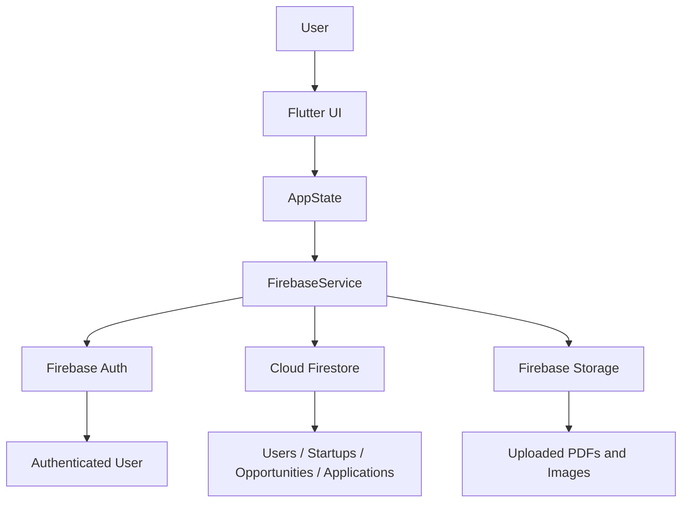
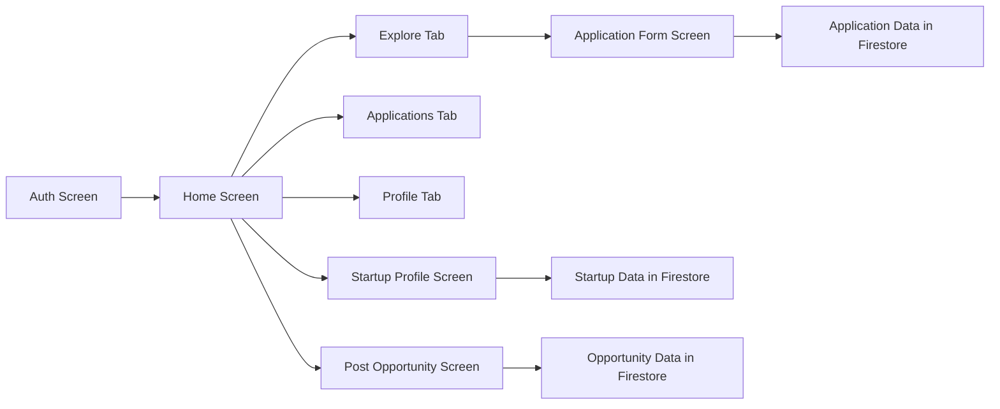
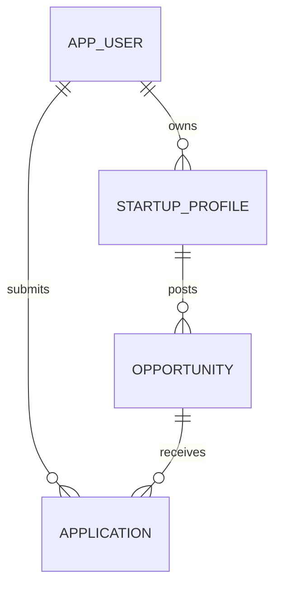

# ALU Connect

ALU Connect is a Flutter-based internship and opportunity platform designed for the ALU assignment. It connects ALU students with startup opportunities and allows startup owners to post opportunities, review applications, and manage student interest in a simple, polished workflow.

The application is built to demonstrate a complete end-to-end experience with authentication, role-based navigation, real-time data storage, and document uploads. It uses Firebase as the backend and Flutter for the mobile interface.

## 1. Project Overview

ALU Connect provides two main user roles:

- Student users can browse opportunities, apply to internships, and track their submitted applications.
- Startup owner users can create a startup profile, post internship opportunities, review incoming applications, and update application status.

The app also supports a dual-role experience where one user can act as both a student and a startup owner.

## 2. Key Features

- Secure sign-in and sign-up experience with email and password authentication
- Role selection before or during account creation
- Student-friendly application form with required fields and PDF uploads
- Startup profile creation for verified or demo startup accounts
- Opportunity posting for startup owners
- Home, Explore, Applications, and Profile tabs for role-based navigation
- Application review flow with accept, reject, and email actions
- Firebase-backed persistence for users, startups, opportunities, applications, and uploaded documents
- Demo-safe fallback behavior when Firebase is temporarily unavailable

## 3. Architecture

### 3.1 High-Level Architecture



### 3.2 Screen and Feature Flow



### 3.3 Data Model Overview



## 4. Tech Stack

- Flutter + Dart
- Material UI components
- Firebase Authentication
- Cloud Firestore
- Firebase Storage
- File picker for document uploads
- URL launcher for external actions
- UUID for unique document and entity IDs

## 5. Project Structure

```text
android/                # Android project files and Firebase configuration
ios/                    # iOS project files
lib/
  main.dart              # App entry point
  firebase_options.dart  # Firebase configuration for FlutterFire
  theme.dart             # Custom visual theme
  models/                # AppUser, StartupProfile, Opportunity, Application
  services/              # Firebase service wrapper
  state/                 # AppState for app-wide state management
  ui/                    # Auth, home, application form, startup profile, and opportunity UI
test/                    # Widget and state tests
firestore.rules         # Firestore security rules
storage.rules           # Firebase Storage rules
firebase.json           # Firebase project configuration for hosting and rules deployment
pubspec.yaml            # Flutter project dependencies
```

## 6. Prerequisites

Before running the project locally, make sure you have:

- Flutter SDK installed and configured
- A supported editor such as Visual Studio Code or Android Studio
- An Android emulator, iOS simulator, or a physical device
- A Firebase project with the following services enabled:
  - Authentication
  - Firestore Database
  - Firebase Storage
- Optional but recommended: Firebase CLI for deploying rules

## 7. Installation and Setup

### 7.1 Clone the repository

```bash
git clone <your-repository-url>
cd formative_assignment
```

### 7.2 Install dependencies

```bash
flutter pub get
```

### 7.3 Firebase setup

This project already contains Firebase configuration files for the current assignment project. If you are using a different Firebase project, regenerate the configuration with:

```bash
flutterfire configure
```

### 7.4 Enable Firebase services

In your Firebase console, enable the following:

1. Authentication
   - Enable Email/Password sign-in

2. Firestore Database
   - Create a Firestore database in production or test mode

3. Firebase Storage
   - Enable Storage for uploaded PDFs and images

### 7.5 Deploy Firestore and Storage rules

If you are using the Firebase CLI, run:

```bash
firebase login
firebase deploy --only firestore:rules,storage
```

If the CLI is not installed yet, install it first:

```bash
npm install -g firebase-tools
```

## 8. Running the App

Run the app locally with:

```bash
flutter run
```

For web development, you can also run:

```bash
flutter run -d chrome
```

## 9. Running Tests

```bash
flutter test
```

## 10. Application Workflow

### Student flow

1. Sign up or sign in as a student.
2. Browse available opportunities.
3. Open an opportunity and tap Apply now.
4. Fill in the required personal and academic details.
5. Upload a cover letter and CV as PDF files.
6. Submit the application.
7. View the application later in the Applications tab.

### Startup owner flow

1. Sign up or sign in as a startup owner.
2. Create a startup profile.
3. Post an opportunity for students.
4. Review incoming applications.
5. Accept or reject applications.
6. Contact applicants through email actions.

## 11. Firebase Data Collections

The app uses the following Firestore collections:

- users
  - Stores user profile information, roles, and startup linkage
- startups
  - Stores startup profile details created by startup owners
- opportunities
  - Stores internship opportunities posted by startup owners
- applications
  - Stores student applications, related documents, and status updates

## 12. Security Notes

The Firestore and Storage rules are configured to protect access to user and application data. In a real production deployment, these rules should be reviewed carefully and tightened further based on your application requirements.

## 13. Notes for Demo and Assignment Use

- The app includes a demo-safe fallback so it can still be opened even if Firebase is not fully available at that moment.
- For full persistence and real backend behavior, Firebase Authentication, Firestore, and Storage must be configured correctly.
- The app is designed for demonstration purposes and academic submission workflows.

## 14. Useful Commands

```bash
flutter pub get
flutter test
flutter run
firebase deploy --only firestore:rules,storage
```

## 15. Summary

ALU Connect is a functional Flutter + Firebase prototype for connecting ALU students with startup internship opportunities. It demonstrates a full student-startup workflow in a clean, polished interface while also showing how Firebase can be used for authentication, storage, and real-time data management.
